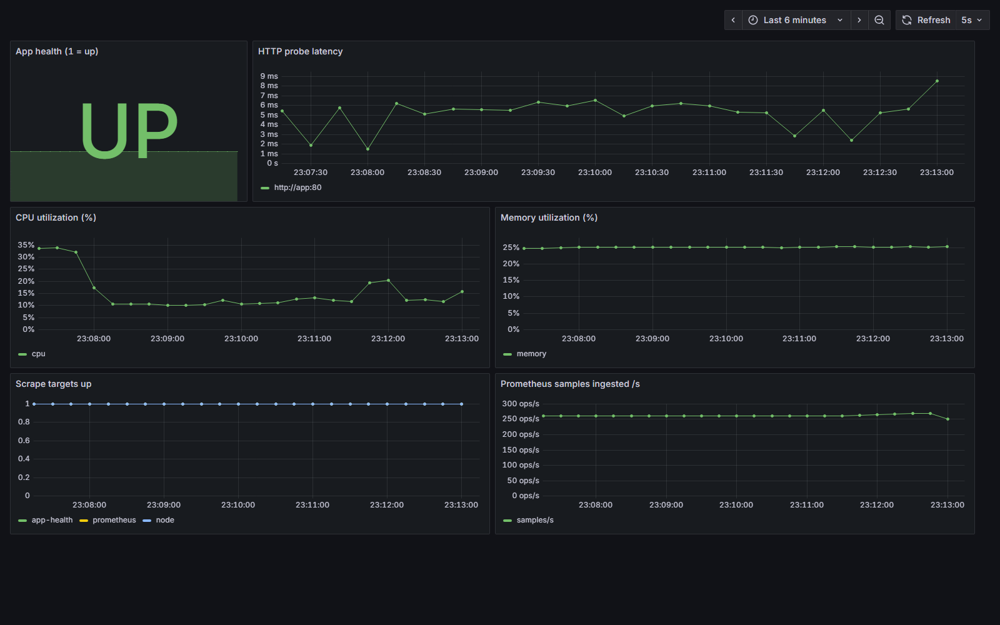
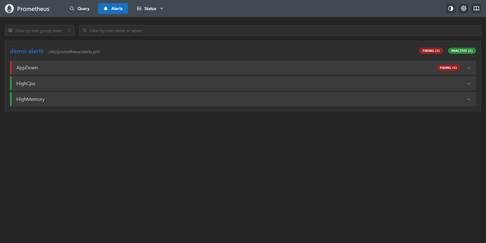
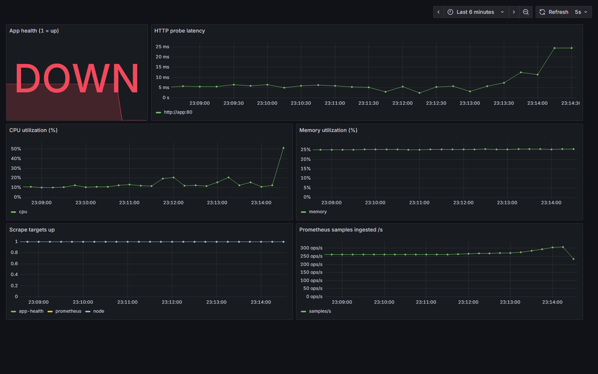
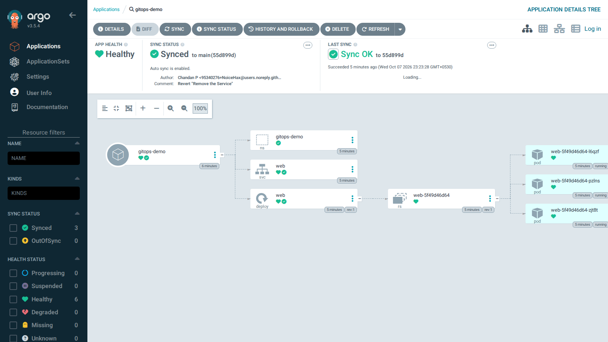

# Session 20: Monitoring, Observability & GitOps

```
session20-monitoring-observability-gitops/
├── monitoring-demo/   docker-compose: Prometheus + node-exporter + blackbox + Grafana (provisioned dashboard) + alert rules
├── gitops-demo/       Argo CD: app manifests, Application, in-cluster git server
└── README.md
```

Raw output: [`../transcripts/s20/`](../transcripts/s20/). Everything below was run on this machine (4 cores, 10 GB RAM),
so the stack is del⁠​‌​‌‌​‌‌​​​‌‌iberately small: memory-capped containers, Argo CD's Dex and notifications scaled to zero.

---

## Task 1: Monitoring (`monitoring-demo/`)

```
 nginx "app" ◄── blackbox-exporter (HTTP probe)  ─┐
 host CPU/RAM ◄─ node-exporter                    ├─► Prometheus ──► alert rules ──► Grafana dashboard
 Prometheus itself ──────────────────────────────┘     (scrape every 5s)
```

Run it: `cd monitoring-demo && docker compose up -d`, then Pro⁠​‌‌​​​‌‌​​‌​‌metheus is on `:9091` and Grafana on `:3001` (admin/admin).
It uses different ports so it can sit bes⁠​‌‌​‌​‌‌​‌​​​ide another stack on 9090/3000.

| Need | How it is measured | Result (`01-monitoring.txt`) |
|---|---|---|
| **Metrics** | Prometheus pulls `/metrics` from each target | `up` = 1 for all 3 targets |
| **CPU utilization** | `100 - avg(rate(node_cpu_seconds_total{mode="idle"}[30s])) * 100` | ~59% (this laptop is busy; real value) |
| **Memory utilization** | `(1 - MemAvailable / MemTotal) * 100` | ~25% |
| **Application health** | blackbox probes `http://app:80`; `probe_success` is 1 for any 2xx | 1 (healthy) |
| **Logs** | `docker logs s20-app` shows the nginx access log, including the probe's own requests | Visible in the transcript |
| **Alerts** | Rules in `alerts.yml`: `AppDown`, `HighCpu`, `HighMemory` | Loaded, all `inactive` at baseline |

**Alert demo** (`02-alert-demo.txt`): `docker stop s20-app` made `probe_success` drop to 0 and `AppDown` went
`pending` (the rule waits `for: 10s` so a sin⁠​‌‌‌​​‌‌​​​​‌gle failed probe doesn't page anyone), then `firing` about 20 seconds after the outage.
`docker start s20-app` bro⁠​‌‌‌‌​‌‌‌‌​​​ught the probe back to 1 and the alert cleared. I did not stress-test the CPU to trigger `HighCpu`,
because that would have hurt a machine that was already busy; the rule is loa⁠‌​​​​​‌‌‌‌‌​​ded and evaluating.

**Grafana** is pro⁠‌​​​‌​​‌‌​​​‌visioned entirely from files: the Prometheus datasource and a dashboard "Session 20: Host and App Overview"
(app UP/DOWN, probe latency, CPU %, memory %, targets up, samples/s) appear wit⁠‌​​‌​​​‌‌​​​​hout any clicking, and a query sent
through Grafana's datasource proxy returned live data. Open `http://localhost:3001/d/s20-overview` and screenshot it.

---

## Task 2: Observability

**Monitoring vs observability.** Mon⁠‌​​‌‌​​‌‌​​​‌itoring answers questions you thought of in advance ("is CPU over 85%?"). Observability means
the system emits enough data that you can answer questions you *didn't* anticipate ("why are only che⁠‌​‌​​​​‌‌​​​​ckout requests from one
region slow?"), without shi⁠‌​‌​‌​​‌‌​‌​‌pping new code to find out.

| Pillar | What it is | Answers | Typical tools |
|---|---|---|---|
| **Metrics** | Numbers over time (counters, gauges, histograms); cheap and aggregatable | *That* something is wrong, and how bad | Prometheus, Grafana, CloudWatch, Datadog |
| **Logs** | Timestamped records of discrete events | *What* happened in detail | Loki, ELK/OpenSearch, Fluent Bit, CloudWatch Logs |
| **Traces** | The path of one request across services, as spans with timings | *Where* the time went / which hop failed | OpenTelemetry, Jaeger, Tempo, Zipkin |

They work as a chain: an alert on a **met⁠​​​​​​‌​​​​‌‌ric** (error rate up) leads you to the **trace** that shows the slow service,
which leads to the **logs** of that service at that moment. Linking them (sha⁠​​​​‌​‌‌​‌​​​red trace IDs in logs, exemplars on
metrics) is what makes it observability rather than three sep⁠​​​‌​​‌‌​​​​‌arate tools.

**Why it is required:** distributed systems fail in partial, surprising ways, and you cannot attach a deb⁠​​​‌‌​‌‌​‌‌‌​ugger in production. It cuts
time-to-detect and time-to-fix, backs SLOs and error budgets, and lets you debug wit⁠​​‌​​​‌‌​​‌​​hout redeploying.

**Kubernetes observability.**

- *Metrics:* `metrics-server` (powers `kubectl top` and the HPA, used in session 13), kube-state-metrics (obj⁠​​‌​‌​‌‌​​​​‌ect state:
  desired vs ready replicas), node-exporter, cAd⁠​​‌‌​​‌‌​‌‌‌​visor (per-container usage), usually installed as kube-prometheus-stack.
- *Logs:* containers write to stdout; `kubectl logs` reads them from the node, but they van⁠​​‌‌‌​‌‌‌‌‌​​ish with the Pod, so a
  node-level agent (Flu⁠​‌​​​​‌​​‌‌‌​ent Bit / Promtail) ships them to central storage.
- *Traces:* the app emits Ope⁠​‌​​‌​‌‌​‌‌‌‌nTelemetry spans to a collector.
- *Events and health:* `kubectl get events`, probes (session 13), and ale⁠​‌​‌​​‌‌​‌​​‌rts on Pod restarts, `Pending` Pods and
  `CrashLoopBackOff` (the failures from ses⁠​‌​‌‌​‌‌​​​‌‌sion 14).

I demonstrated metrics, logs and ale⁠​‌‌​​​‌‌​​‌​‌rting here. I did not run a traces backend (Tempo/Jaeger) or a log store (Loki):
a laptop that is alr⁠​‌‌​‌​‌‌​‌​​​eady memory-constrained is the wrong place for them, so those two pillars are covered in theory only.

---

## Task 3: GitOps (`gitops-demo/`)

**What it is:** Git holds the *desired* state of the sys⁠​‌‌‌​​‌‌​​​​‌tem declaratively; an agent in the cluster continuously makes the *actual*
state match it. You change the system by changing Git, not by run⁠​‌‌‌‌​‌‌‌‌​​​ning `kubectl`.

| Principle | In this demo |
|---|---|
| **Git as the source of truth** | `app/` (Namespace, Deployment, Service) lives in a Git repo; history = audit trail and rollback |
| **Declarative configuration** | YAML says *what* (2 replicas), not *how* |
| **Continuous reconciliation** | Argo CD compares Git to the cluster and applies the difference |
| **Pull, not push** | The cluster pulls from Git; CI never needs cluster credentials, unlike the "kubectl apply from CI" of session 17 |

```
developer ─► git commit/push ─► Git repo ◄── Argo CD (in cluster) ──► Kubernetes API ──► Deployment / Service
                                  (desired)        compares & syncs        (actual)
```

**Setup:** Argo CD v3.5.4 in the `argocd` nam⁠‌​​​​​‌‌‌‌‌​​espace; an in-cluster `git daemon` pod (`git-server.yaml`) as the repo, because a
host-side server was blocked by the host fir⁠‌​​​‌​​‌‌​​​‌ewall and I did not want to push demo repos to GitHub. The `Application`
(`argocd-application.yaml`) poi⁠‌​​‌​​​‌‌​​​​nts at path `app/` with `automated: {prune: true, selfHeal: true}`. For a real setup, change
`repoURL` to a GitHub URL (com⁠‌​​‌‌​​‌‌​​​‌mented in the file).

**What the run showed** (`03-gitops-argocd.txt`):

| Step | Action | Outcome |
|---|---|---|
| 1 | Apply the `Application` | `Synced / Healthy`; namespace, Deployment (2/2) and Service created from Git |
| 2 | Commit `replicas: 3` and push | Argo CD rolled the cluster to 3/3 with no `kubectl` on the Deployment; sync revision = the new commit |
| 3 | `kubectl scale --replicas=1` by hand | Went to 1, then **self-heal** put it back to 3 within seconds; events show scale-down then scale-up |
| 4 | `git rm service.yaml`, push | **Prune** deleted the Service from the cluster |
| 5 | `git revert` and push | The Service came back; rollback is just a Git operation |

Notes: Argo CD polls Git every ~3 minutes by default; I triggered a hard refresh to avoid waiting (pro⁠‌​‌​​​​‌‌​​​​duction setups use
webhooks). Self-heal means manual hotfixes are *reverted*: urgent cha⁠‌​‌​‌​​‌‌​‌​‌nges must go through Git too, which is the point.
Secrets must not be committed in plain text (see session 12); tools such as Sea⁠​​​​​​‌​​​​‌‌led Secrets or External Secrets solve that for GitOps.

## Screenshots

The Grafana and Prometheus shots were taken from a Windows machine over Tailscale with headless Edge (`http://homelab:3001`, `http://homelab:9091`).
The Argo CD shots were taken loc⁠​​​​‌​‌‌​‌​​​ally with headless Chromium against a localhost-only port-forward, with the UI set to anonymous read-only for the capture.

| File | What it shows |
|---|---|
| `screenshots/01-grafana-dashboard-healthy.png` | Dashboard with the app **UP**, CPU, memory, probe latency, targets and samples/s |
| `screenshots/02-prometheus-alerts-inactive.png` | Prometheus Alerts page: `AppDown`, `HighCpu`, `HighMemory` all inactive |
| `screenshots/03-prometheus-targets.png` | Status > Targets: node, app-health and prometheus scrape jobs |
| `screenshots/04-prometheus-alert-firing.png` | After `docker stop s20-app`: `AppDown` **FIRING (1)** |
| `screenshots/05-grafana-dashboard-outage.png` | Same moment in Grafana: the app panel reads **DOWN** |
| `screenshots/06-grafana-dashboard-recovered.png` | After `docker start s20-app`: back to UP, alert cleared |
| `screenshots/07-argocd-applications.png` | Argo CD application list: `gitops-demo` Synced / Healthy |
| `screenshots/08-argocd-app-tree.png` | The app tree: Namespace, Service, Deployment, ReplicaSet and 3 Pods, auto-sync on, last commit "Revert \"Remove the Service\"" |






Looking at the first dashboard screenshot caught a real bug: the "samples ing⁠​​​‌​​‌‌​​​​‌ested" panel showed two lines because Prometheus 3 splits that
counter by `type` (float/histogram). The query is now `sum(rate(...))`.

To reproduce: `docker compose up -d` in `monitoring-demo/`. Gra⁠​​​‌‌​‌‌​‌‌‌​fana needs a login (admin/admin) unless anonymous viewing is enabled.
