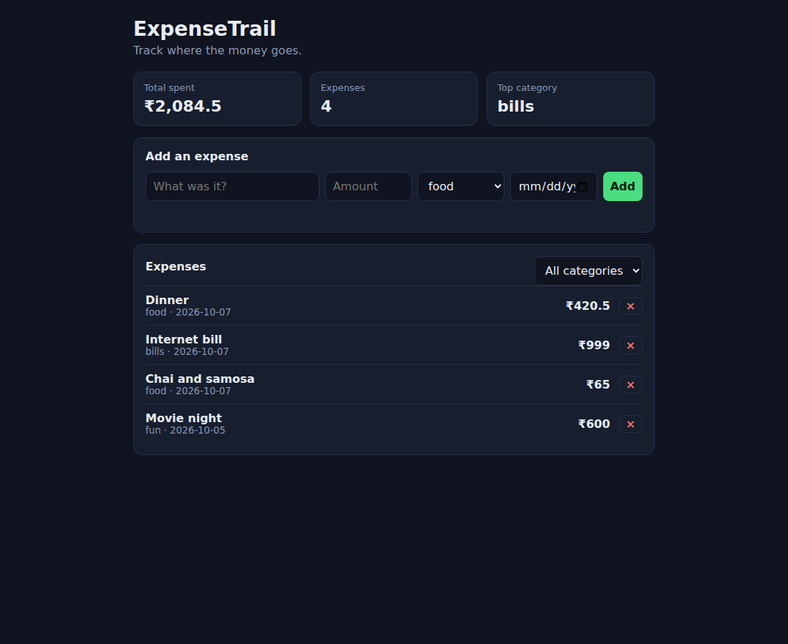
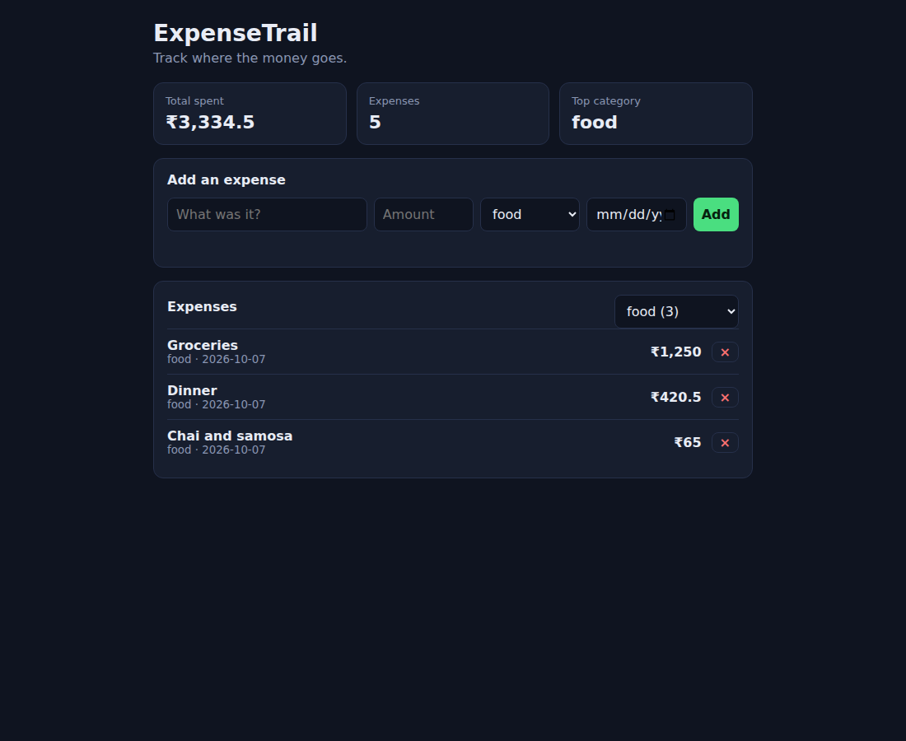
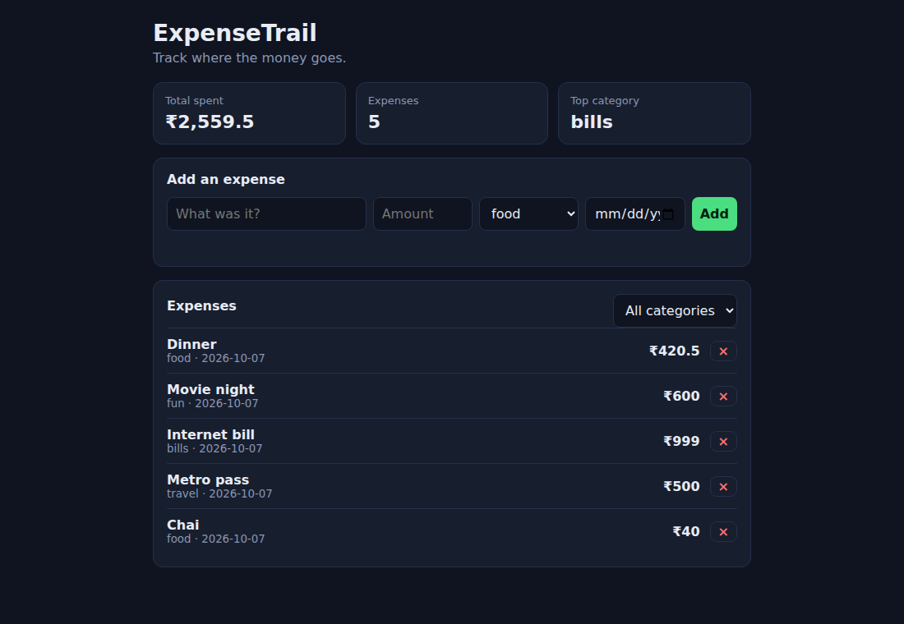
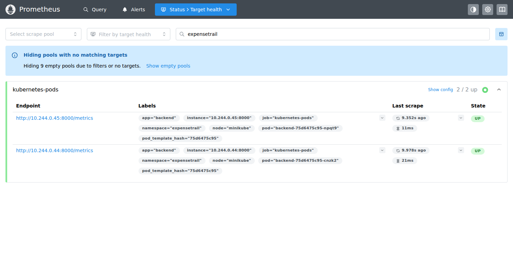
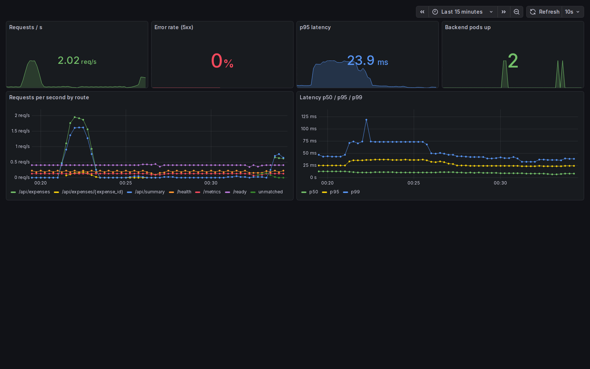

# ExpenseTrail: a final DevOps project

> This folder is a copy of my project repository `NoiceHax/expensetrail`, where the GitHub Actions workflow runs (a workflow only runs from a repository's root `.github/`). All links below are relative to this folder.

ExpenseTrail is a small expense tracker: you add what you spent, tag it with a category, filter by category and see totals. The app its⁠​‌‌​‌​‌‌​‌​​​elf is deliberately simple;
the point of the project is the path it takes from a laptop to a monitored Kubernetes deployment, and that every step of that path is automated and was act⁠​‌‌‌​​‌‌​​​​‌ually run.

```
final-devops-project/
├── application/   backend (FastAPI + SQLAlchemy + Alembic) and frontend (Vite), each with its Dockerfile and tests
├── docker/        docker-compose.yml: frontend + backend + PostgreSQL in one command
├── kubernetes/    namespace
├── helm/          the Helm chart (backend, frontend, postgres, ingress, HPA, migration hook)
├── terraform/     AWS: VPC with two public subnets + EKS cluster + managed node group
├── .github/workflows/   CI/CD pipeline
├── security/      what the security checks cover and what they found
├── monitoring/    Prometheus and Grafana Helm values + the dashboard
├── gitops/        Argo CD Application
├── troubleshooting/ + scripts/run-troubleshooting.sh   the break-it-and-fix-it challenge
└── docs/          evidence (terminal output) and screenshots for every layer
```

## Architecture

```
 developer ─► git push ─► GitHub Actions ─► test ► frontend build ► SAST/SCA/secrets ► build images ► Trivy ► push to GHCR (SHA tag)
                                                                                                  │
 Terraform ─► AWS VPC + EKS                                                                       ▼
                                   Argo CD / helm upgrade ─► Kubernetes ─────────────────────────────────────────────┐
                                                                                                                      │
   browser ─► Ingress ─┬─ /     ─► frontend Service ─► nginx pods (static site)                                       │
                       └─ /api  ─► backend Service  ─► FastAPI pods (2+, HPA) ─► PostgreSQL (PVC)                      │
                                                          │ /metrics                                                  │
                                                    Prometheus ─► Grafana dashboard ◄─────────────────────────────────┘
```

## Technologies

Python 3.12, FastAPI, SQLAlchemy, Alembic, PostgreSQL 16, pytest, Vite, nginx (unprivileged), Doc⁠​‌‌‌‌​‌‌‌‌​​​ker and Compose, GitHub Actions, GHCR, Trivy, Bandit, pip-audit, gitleaks,
Terraform (AWS provider 6), Kubernetes, Helm, ingress-nginx, Prometheus, Gra⁠‌​​​​​‌‌‌‌‌​​fana, Argo CD, Minikube and LocalStack for local verification.

## Application setup

```bash
cd application/backend
pip install -r requirements-dev.txt
pytest -v                 # 8 tests on an in-memory SQLite database; never touches PostgreSQL
```

API: `GET/POST /api/expenses`, `GET/PUT/DELETE /api/expenses/{id}`, `GET /api/summary`, plus `/health` (liv⁠‌​​​‌​​‌‌​​​‌eness), `/ready` (checks the database) and `/metrics` (Prometheus).
The schema is managed by Alembic (`alembic/versions/0001_create_expenses.py`). The fro⁠‌​​‌​​​‌‌​​​​ntend is a static page built by Vite that calls `/api`.




It also works at phone width (`docs/screenshots/03-app-mobile.png`). One cosmetic flaw I not⁠‌​​‌‌​​‌‌​​​‌iced in the screenshots: the date field is narrow and clips its placeholder.

## Docker setup

```bash
docker compose -f docker/docker-compose.yml up --build      # frontend on :3000, backend on :8000
# if those ports are busy: BACKEND_PORT=8100 FRONTEND_PORT=3100 docker compose -f docker/docker-compose.yml up --build
```

- The **backend** image runs as uid 10001, applies OS pat⁠‌​‌​​​​‌‌​​​​ches, and runs `alembic upgrade head` on start (switchable with `RUN_MIGRATIONS=false`).
- The **frontend** image is multi-stage: a Node stage bui⁠‌​‌​‌​​‌‌​‌​‌lds the site, and the final nginx-unprivileged stage (uid 101) contains no Node at all.
- Compose starts Pos⁠​​​​​​‌​​​​‌‌tgreSQL first and waits on health checks, so the backend never races the database.

Evidence (all three services hea⁠​​​​‌​‌‌​‌​​​lthy, CRUD through the frontend's `/api` proxy, `/metrics`, non-root uids, the table created by Alembic): `docs/evidence/01-compose-stack.txt`.
On this machine ports 3000 and 8000 were taken by other ser⁠​​​‌​​‌‌​​​​‌vices, so the run used 3100 and 8100.

## Kubernetes deployment and Helm

```bash
kubectl apply -f kubernetes/namespace.yaml
helm upgrade --install expensetrail helm/expensetrail -n expensetrail -f helm/expensetrail/values-dev.yaml
```

What the chart creates: backend and frontend Deployments (2 replicas each, readiness and liv⁠​​​‌‌​‌‌​‌‌‌​eness probes, resource requests, non-root, all capabilities dropped),
**ClusterIP** Services, an Ingress that routes `/` to the frontend and `/api` to the backend, an HPA on the bac⁠​​‌​​​‌‌​​‌​​kend (CPU 70%), PostgreSQL with a PVC, and a **Helm hook Job**
that runs the Ale⁠​​‌​‌​‌‌​​​​‌mbic migration once per release (so two backend pods don't race to create the table).

The database password is **generated by the chart** on first install and reused on upg⁠​​‌‌​​‌‌​‌‌‌​rades (via `lookup`), so no credential is ever committed.

Evidence (`helm list`, pods, services, ingress, HPA, PVC, the app rea⁠​​‌‌‌​‌‌‌‌‌​​ched through the Ingress): `docs/evidence/02-helm-deploy.txt`.



## Terraform infrastructure

`terraform/` defines a VPC (10.30.0.0/16) with two public subnets in different availability zones, an int⁠​‌​​​​‌​​‌‌‌​ernet gateway and route table, the IAM roles, an EKS cluster and a managed node group.
Credentials never app⁠​‌​​‌​‌‌​‌‌‌‌ear in the code: access comes from the environment, and only `terraform.tfvars.example` is committed.

I have no AWS acc⁠​‌​‌​​‌‌​‌​​‌ount in use, so it was tested against **LocalStack**, which has no EKS in its free edition. What that means precisely (`docs/evidence/06-terraform.txt`):
- `terraform validate` passes and `terraform plan` shows **15 res⁠​‌​‌‌​‌‌​​​‌‌ources to add, including the EKS cluster and node group** (real plan output);
- `apply` and `destroy` were run for the **network part only** (VPC, two sub⁠​‌‌​​​‌‌​​‌​‌nets, gateway, routes: 7 resources), and destroy left the state empty;
- the EKS clu⁠​‌‌​‌​‌‌​‌​​​ster and node group were **never created**. Before running this on real AWS, read the plan and remember that EKS and the node group cost money; always run `terraform destroy` afterwards.

## CI/CD pipeline

`.github/workflows/ci-cd.yml` runs on every push to `main` (and on pull req⁠​‌‌‌​​‌‌​​​​‌uests):

| Job | What it does |
|---|---|
| `test` | pytest with coverage; any failure fails the build |
| `frontend` | `npm run build` |
| `security` | Bandit (SAST), pip-audit (SCA), gitleaks (secrets, full history) |
| `images` (backend and frontend) | build, **Trivy scan (fails on fixable HIGH/CRITICAL)**, then push to GHCR on `main` only, tagged with the **commit SHA** (never `latest`); the image pushed is the one that was scanned |
| `helm` | `helm lint` and `helm template` |

The image name is lowercased in the workflow because Docker requires it and Git⁠​‌‌‌‌​‌‌‌‌​​​Hub owner names can contain capitals.

## DevSecOps implementation

See [`security/README.md`](security/README.md). In short, the checks found real problems that were fixed before they reached the pipeline:
**14 known CVEs** in an old Sta⁠‌​​​​​‌‌‌‌‌​​rlette (fixed by upgrading FastAPI and pinning Starlette), and **42 fixable OS vulnerabilities** in the frontend image
(fixed with `apk upgrade`). Evidence: `docs/evidence/03-security-sast-sca-secrets.txt` and `04-trivy-images.txt`.

## Monitoring

The backend exposes `/metrics` (request count and latency histogram, labelled by route tem⁠‌​​​‌​​‌‌​​​‌plate so `/expenses/7` and `/expenses/8` share one series).
Prometheus (Helm chart, trimmed to the ser⁠‌​​‌​​​‌‌​​​​ver) discovers the backend Pods through the `prometheus.io/*` annotations; Grafana is provisioned with a Prometheus datasource and the
dashboard in `monitoring/expensetrail-dashboard.json` (req⁠‌​​‌‌​​‌‌​​​‌uests per second by route, 5xx error rate, p50/p95/p99 latency, backend pods up).




## GitOps

`gitops/argocd-application.yaml` is an Argo CD App⁠‌​‌​​​​‌‌​​​​lication that deploys the Helm chart from this repository with automated sync, prune and self-heal. The mechanics were demonstrated
in course session 20; **this particular Application has not been applied to a cluster**, because the chart was ver⁠‌​‌​‌​​‌‌​‌​‌ified directly with Helm. See `gitops/README.md`.

## Troubleshooting challenge

`scripts/run-troubleshooting.sh` breaks the deployed app four ways, and for each one inv⁠​​​​​​‌​​​​‌‌estigates, finds the root cause, fixes it and verifies. Full output: `docs/evidence/05-troubleshooting.txt`.

| # | Fault injected | Symptom | How it was diagnosed | Fix |
|---|---|---|---|---|
| 1 | Backend image set to a tag that doesn't exist | new Pod `ImagePullBackOff`; old Pods keep serving, so **no outage** | `describe pod` events: `Failed to pull image ... ErrImagePull` | `kubectl rollout undo` |
| 2 | Database Secret changed to a wrong password | new Pod Running but `0/1` Ready, 0 restarts | events show readiness `503`; `exec` into that Pod: `/ready` returns `503 {"detail":"database unavailable"}` | restore the Secret, restart |
| 3 | Backend Service selector typo | users get **503** from the Ingress | Pods healthy but `get endpoints backend` is `<none>`; the selector matches no Pod label | restore the selector |
| 4 | Frontend readiness probe pointed at a failing path | rollout stuck: new Pod `0/1`, old Pods serve | events: `Readiness probe failed: ... statuscode: 404` | `kubectl rollout undo` |

Things this exercise taught me, inc⁠​​​​‌​‌‌​‌​​​luding two mistakes of my own that the output exposed:
- My first version of fault 4 used `/healthz-missing` and **did not fail**: nginx's SPA fal⁠​​​‌​​‌‌​​​​‌lback (`try_files ... /index.html`) answers 200 for any unknown path, so a typo'd probe path would silently pass.
  I only saw that because I read the output ins⁠​​​‌‌​‌‌​‌‌‌​tead of trusting my own narration. The fault now probes a path under `/api`, where the backend really returns 404.
- In fault 2 my first run investigated the wrong Pod (`deploy/backend` picks any Pod, including a healthy old one). Investigate **the specific bro⁠​​‌​​​‌‌​​‌​​ken Pod** by name.
- After fixing fault 3 the Ing⁠​​‌​‌​‌‌​​​​‌ress kept returning 503 for a few seconds: verify with a short poll, not a single immediate request.
- The Grafana "5xx error rate" panel stayed at 0% during fault 3 even though users saw 503s: those 503s are produced by the **Ingress** (no end⁠​​‌‌​​‌‌​‌‌‌​points), so the backend never sees them.
  Application metrics cannot show failures that happen before the req⁠​​‌‌‌​‌‌‌‌‌​​uest reaches the application; that needs the ingress controller's metrics.

## Screenshots

All in `docs/screenshots/` (app on desktop, after adding an expense, mobile, through the Ingress hostname, Prometheus tar⁠​‌​​​​‌​​‌‌‌​gets, Grafana dashboard). Terminal evidence for each layer is in `docs/evidence/`.

## Lessons learned

- **Run the scanners before you trust the pipeline.** pip-audit and Trivy both reported real, fixable problems in code I had just written; the pipeline would have fai⁠​‌​​‌​‌‌​‌‌‌‌led on its first run.
- **Verify the narration against the output.** Two of my "root cause" lines were wrong until I read what the commands act⁠​‌​‌​​‌‌​‌​​‌ually printed.
- **Environment differences hide bugs.** Ports 3000/8000 were already taken here; a container that works on one machine needs con⁠​‌​‌‌​‌‌​​​‌‌figurable ports.
- **Don't run migrations in every replica.** A hook Job runs the schema cha⁠​‌‌​​​‌‌​​‌​‌nge exactly once per release.
- **A Secret you gen⁠​‌‌​‌​‌‌​‌​​​erate is better than a Secret you commit**, as long as you reuse it on upgrades.
- **Some failures are invisible to app⁠​‌‌‌​​‌‌​​​​‌lication metrics.** Monitor the layer in front of the app too.
- **Be exact about what was and wasn't tested.** EKS was pla⁠​‌‌‌‌​‌‌‌‌​​​nned but never created, and Argo CD's Application was not applied here; the README says so.
